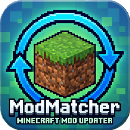

*Read in English | [Читать на русском](README.ru.md)*

# 🔄 ModMatcher

**ModMatcher** is a user-friendly Windows desktop application designed to automatically find and download updates for your Minecraft mods. 

The application finds mods from your chosen directory, then finds them in the massive Modrinth database and allows you to download any versions of mods for the desired downloader and game version in one click.

## ✨ Key Features

* 🔍 **Smart Scanning:** Identifies mods by their SHA-1 hashes via the Modrinth API. If a mod isn't in the database, the app will parse its metadata locally (`fabric.mod.json`, `mods.toml`, `quilt.mod.json`, etc.).
* ⚙️ **Multi-Loader Support:** Fully supports Fabric, Forge, NeoForge, Quilt etc.
* 💾 **Backup System:** Create a ZIP archive of your current mods folder with a single click so you never lose your data during updates.
* ⚡ **Multithreading:** Asynchronous file downloading, icon fetching, and update checking — the interface remains smooth and responsive at all times.
* 🎯 **Flexible Downloading:** Mass update all your mods at once, or cherry-pick specific ones to download.
* 📦 **Portable:** The application is delivered as a single `.exe` file and does not require installing anything else on the user's device.

## 🚀 Installation & Usage (For Users)

1. Go to the [Releases](../../releases) page in this repository.
2. Download the `ModMatcher.exe` from the latest release.
3. Run `ModMatcher.exe`.

> **⚠️ Note:** Since the application is compiled into a single executable without a paid digital signature, sometimes Windows Defender or SmartScreen might show a warning on the first launch. Click *"More info"* -> *"Run anyway"*.

## 📖 How to Use

1. **Set Paths:** At the top of the window, select the source folder containing your current mods and the destination folder where the new versions should be saved.
2. **Wait for Scan:** The app will automatically find all `.jar` and `.zip` files, calculate their hashes, and fetch all needed information.
3. **Apply Filters:** In the right panel, select your target Minecraft version (e.g., `1.20.1`) and your mod loader (e.g., `Fabric`).
4. **Check for Updates:** Click the `Проверить наличие версий` (Check for updates) button. The app will communicate with Modrinth servers and highlight mods that have an update available.
5. **Download:** Select the desired mods (or leave them all) and click `Загрузить` (Download). The new `.jar` files will appear in your chosen destination folder!

## 💻 Tech Stack
* Language: Python 3.13+
* GUI: PySide6 (Qt for Python)
* Networking: `requests` library
* API: Official [Modrinth API v2](https://docs.modrinth.com/api/)

Developed with ❤️ for the Minecraft community.
